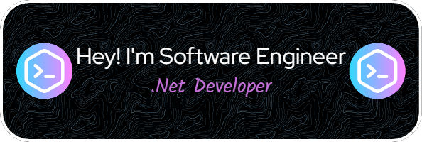

<div align="center"></div>
<h1 align="center">Hello, I'm Sayed Elmahdy </h1>
<h3 align="center">Computer Science student and .NET Core Developer 🌍</h3>

## Computer Science student and .NET Core Developer

- 🌱 .NET Core
- 🎮 Game Developer (Unity)
- 👨‍💻 Problem Solver
- 🚀 BackEnd Developer

&nbsp; &nbsp; *[View My CV](https://drive.google.com/file/d/1bv1Nby3fbytrQT1fWo02NVi4l8VcKvP2/view?usp=sharing)*
<br />

---

### 🔧 Technical Skills

#### Programming Languages


#### Web Development


#### Database Management


#### Other Skills


---
<p align="center">
  
</p>

### 🧐 A Little Bit About Me

```csharp
class SayedElmahdy : Person
{
    public SayedElmahdy()
    {
        Name = "Sayed Elmahdy";
        Age = 23;
        Work = new List<string> { "Backend Developer", "Game Developer", "Freelancer" };
        Education = new List<string> { "Computer Science", "El Shorouk Academy" };
        Hobbies = new List<string> { "Coding", "Gaming", "Problem Solving" };
    }

    public string CurrentLocation() => "Cairo, Egypt";

    public Dictionary<string, List<string>> Currently() => new Dictionary<string, List<string>>
    {
        { "Studying", new List<string> { "Machine Learning", "Deep Learning", "Computer Vision" } },
        { "Reading", new List<string> { "Deep Learning Book", "Design Patterns" } }
    };
}
```

### 💼 Professional Experience

#### 🏬 Z4U Solution Software Company
- **Position**: Backend and Frontend Developer
- **Projects**:
  - **Luka E-Commerce**: An e-commerce platform similar to Amazon, where I work as a backend and frontend developer using Vue.js.
  - **ERP System (Smart)**: An ERP system that I am developing as part of the Z4U Solution Software Company team.

#### 🏬 Art Of Coding (Freelance Team)
- **Role**: Team Leader and Backend Developer
- **Projects**:
  - **El-Burhan Academy Web Application**: An educational platform focusing on the Arabic language, Holy Quran, and Forensic science.
  - **Student Management System**: A project designed to facilitate student management for teachers of various subjects.
  - **Electronic Mind of Alzheimer Patient**: An advanced healthcare management system for managing Alzheimer's patients, integrating real-time patient monitoring, appointment scheduling, and medication management using Flutter and FastAPI.
  - **Individual E-Commerce for Home Food**: An e-commerce platform built with Blazor for both backend and frontend.

---
### 🏆 GitHub Trophies
[](https://github.com/Sayedelmahdy/github-profile-trophy)

### 📜 GitHub History


### </> Top Languages


## 🤝 Connect with Me

- LinkedIn 🔎: https://www.linkedin.com/in/sayed-elmahdy365/
- Email 📧: sayed.work223@gmail.com
- WhatsApp 📱:  https://wa.me/201093307397

---

<p align="center">
    ⭐️ From <a href="https://github.com/Sayedelmahdy/">Sayedelmahdy</a>
</p>
