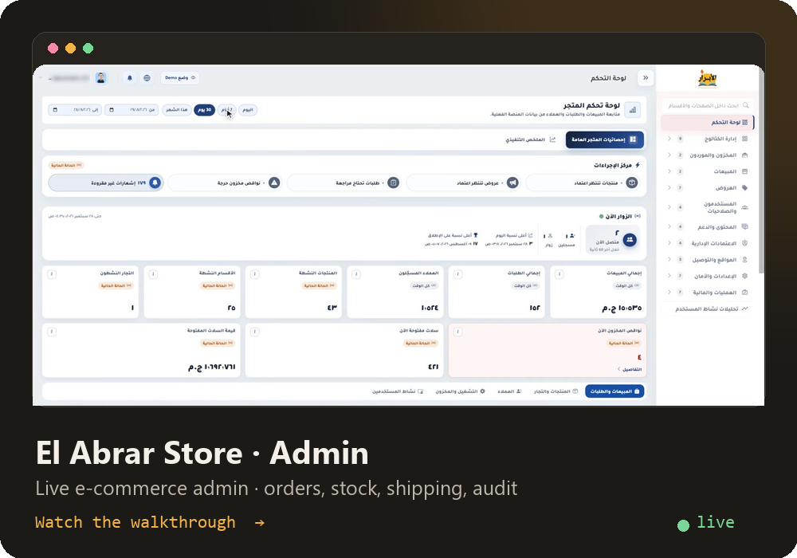
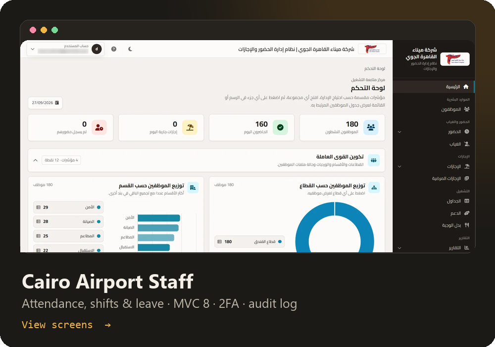
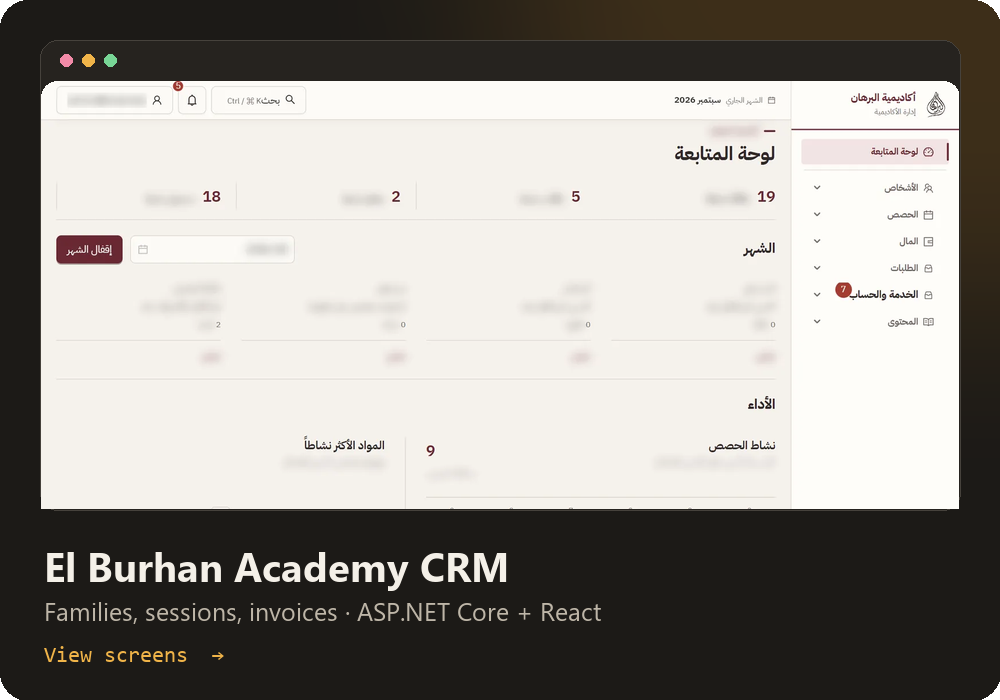
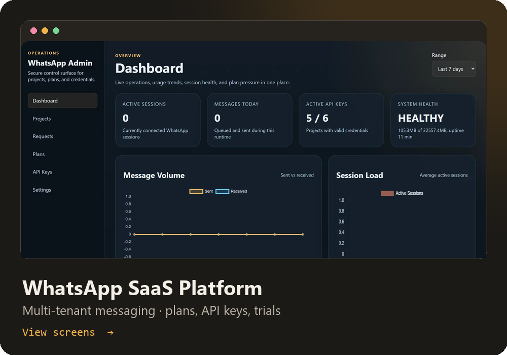
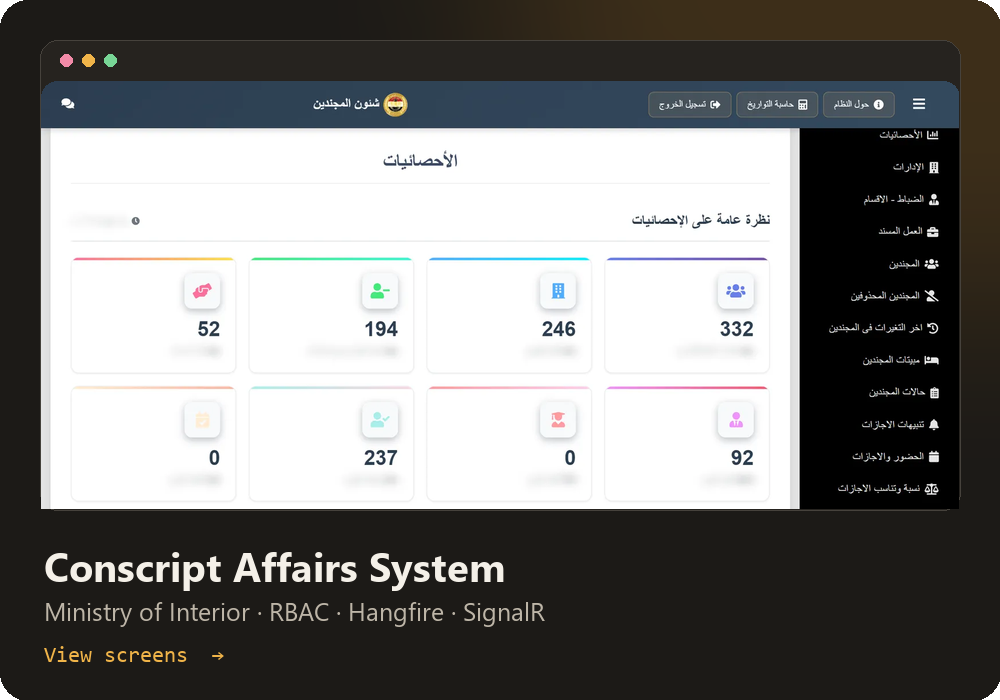
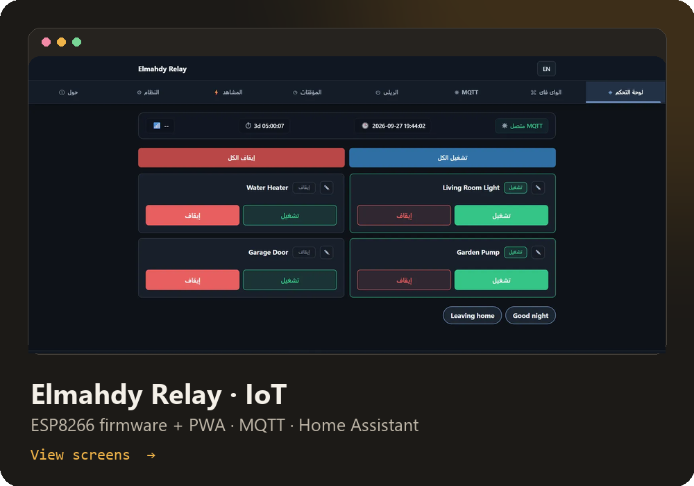

<a href="https://sayed-elmahdy.pages.dev">
  
</a>

<p align="center">
  <a href="https://sayed-elmahdy.pages.dev"></a>
  <a href="https://www.linkedin.com/in/sayed-elmahdy365/"></a>
  <a href="mailto:sayed.work223@gmail.com"></a>
  <a href="https://wa.me/201093307397"></a>
  <a href="https://sayed-elmahdy.pages.dev/assets/Sayed_Elmahdy_CV.pdf"></a>
</p>



## 🟢 Shipped & running in production

<table>
  <tr>
    <td width="50%" valign="top">
      <a href="https://sayed-elmahdy.pages.dev/#production"></a>
    </td>
    <td width="50%" valign="top">
      <a href="https://sayed-elmahdy.pages.dev/#gallery"></a>
    </td>
  </tr>
  <tr>
    <td width="50%" valign="top">
      <a href="https://sayed-elmahdy.pages.dev/#gallery"></a>
    </td>
    <td width="50%" valign="top">
      <a href="https://sayed-elmahdy.pages.dev/#gallery"></a>
    </td>
  </tr>
  <tr>
    <td width="50%" valign="top">
      <a href="https://github.com/Sayedelmahdy/-moi-conscript-affairs-docs"></a>
    </td>
    <td width="50%" valign="top">
      <a href="https://github.com/Sayedelmahdy/Elmahdy-Relay"></a>
    </td>
  </tr>
</table>

<details>
<summary><b>What's under the hood of the live stores</b></summary>
<br>

| | |
|---|---|
| 🏗️ **Platform** | One multi-tenant ASP.NET Core 8 API, each tenant with its own brand, database and domain |
| 💳 **Payments** | 18 gateways behind one adapter (Paymob, Tabby, MyFatoorah, PayPal…), secrets sealed per tenant |
| 🚚 **Shipping** | Pluggable carriers: Aramex (SOAP / WCF), SMSA, weight-based rates, map-first addresses |
| 🔄 **ERP sync** | Items, stock and prices flow ERP → store through an outbox worker |
| ⏱️ **Jobs** | Hangfire: invoices, notifications and a 15-minute payment reconciliation sweep |
| ✅ **Quality** | ~1,900 automated tests · GitHub Actions deploys per tenant · Docker on Linux behind Cloudflare |

</details>

## 🧰 Toolbox

<p>
  <b>Every day</b><br><br>
  
</p>
<p>
  <b>When the job needs it</b><br><br>
  
</p>
<sub>Plus SQL Server, EF Core, Dapper, SignalR, Hangfire, QuestPDF, EPPlus, xUnit, k6, Serilog and Seq.</sub>

## 🌱 Career, as a git log

```text
* a7f3e21 (HEAD -> main) Rejoined Z4U full-time as .NET Developer        Feb 2026 · now
*   5d0c9b4 Merge service: completed military service                    Feb 2026
|\
| * e19b7a2 ASP.NET MVC Developer, government entity                     Feb 2025 · Feb 2026
* | 3c44f10 Part-time at Z4U, remote                                     Feb 2025 · Feb 2026
|/
* 8b2d6e5 Joined Z4U as .NET Developer                                   Apr 2024
* 0f9a13c (tag: v1.0) B.Sc. Computer Science, El Shorouk Academy         2024
```

<picture>
  <source media="(prefers-color-scheme: dark)" srcset="https://raw.githubusercontent.com/Sayedelmahdy/Sayedelmahdy/output/snake.svg">
  <source media="(prefers-color-scheme: light)" srcset="https://raw.githubusercontent.com/Sayedelmahdy/Sayedelmahdy/output/snake-light.svg">
  
</picture>

<p align="center"><sub>Open to software engineering roles · Cairo, Egypt (GMT+2/+3) · usually replies within a day</sub></p>
