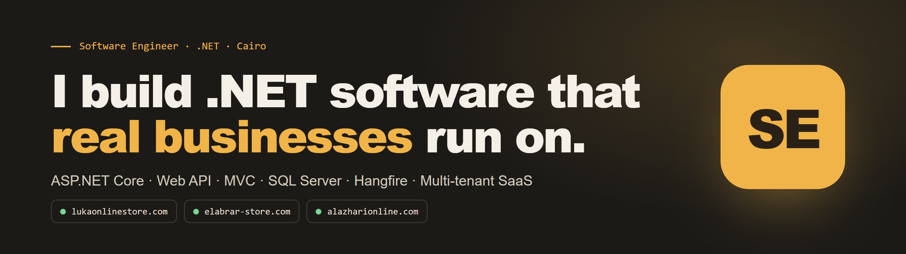

<a href="https://sayed-elmahdy.sayed-work223.workers.dev">
  
</a>

<p align="center">
  <a href="https://sayed-elmahdy.sayed-work223.workers.dev"></a>
  <a href="https://www.linkedin.com/in/sayed-elmahdy365/"></a>
  <a href="mailto:sayed.work223@gmail.com"></a>
  <a href="https://wa.me/201093307397"></a>
</p>

### Hi, I'm Sayed 👋

A **mid-level software engineer** in Cairo with 2.5 years of shipping complete systems in **ASP.NET Core**: Web APIs, MVC applications, dashboards and integrations.

Right now I work at **Z4U** on a multi-tenant ERP and e-commerce platform that serves three live stores from one codebase.

```text
$ git log --oneline --graph
* a7f3e21 (HEAD -> main) Rejoined Z4U full-time as .NET Developer        Feb 2026 · now
*   5d0c9b4 Merge service: completed military service                    Feb 2026
|\
| * e19b7a2 ASP.NET MVC Developer, government entity                     Feb 2025 · Feb 2026
* | 3c44f10 Part-time at Z4U, remote                                     Feb 2025 · Feb 2026
|/
* 8b2d6e5 Joined Z4U as .NET Developer                                   Apr 2024
* 0f9a13c (tag: v1.0) B.Sc. Computer Science, El Shorouk Academy         2024
```

---

### 🟢 In production

| Store | What it runs on |
|---|---|
| [lukaonlinestore.com](https://lukaonlinestore.com) | Multi-tenant ASP.NET Core 8 API · SQL Server · Hangfire · Redis |
| [elabrar-store.com](https://elabrar-store.com) | Same platform, own brand, database and domain · [watch the admin walkthrough](https://sayed-elmahdy.sayed-work223.workers.dev/#production) |
| [alazharionline.com](https://alazharionline.com) | Same platform · Docker on Linux behind Cloudflare |

**Under the hood:** 18 payment gateways behind one adapter (Paymob, Tabby, MyFatoorah, PayPal…) with sealed per-tenant secrets · pluggable shipping (Aramex SOAP, SMSA) · ERP ↔ store sync through an outbox · ~1,900 automated tests · GitHub Actions deploys per tenant.

### 🧩 Selected work

- **[ERP + E-Commerce platform](https://github.com/Sayedelmahdy/erp-ecommerce-platform-overview)**: one .NET 8 API for catalog, inventory, finance and the online store.
- **[Facebook Messenger Campaign API](https://github.com/Sayedelmahdy/fb-messenger-campaign-api)**: OAuth page connect, scheduled campaigns, webhooks and live SignalR updates.
- **[Conscript Affairs System](https://github.com/Sayedelmahdy/-moi-conscript-affairs-docs)**: Ministry of Interior system built during military service. Redacted docs and certificate.
- **Cairo Airport Staff Management**: Arabic-first attendance, shifts and leave with 2FA and audit logs.
- **[Elmahdy Relay](https://github.com/Sayedelmahdy/Elmahdy-Relay)**: ESP8266 smart relay firmware with MQTT, Home Assistant, PWA and OTA.
- **[GameFix Doctor Pro](https://github.com/Sayedelmahdy/GameFixDoctorPro)**: Windows diagnostics tool for gamers.

➡️ Screens from every project are in the [portfolio gallery](https://sayed-elmahdy.sayed-work223.workers.dev/#gallery).

### 🛠️ Stack

<p>
  
  
  
  
  
  
  
  
  
  
  
</p>

<p align="center"><sub>Open to software engineering roles · Cairo, Egypt · <a href="https://sayed-elmahdy.sayed-work223.workers.dev/assets/Sayed_Elmahdy_CV.pdf">Download CV</a></sub></p>
